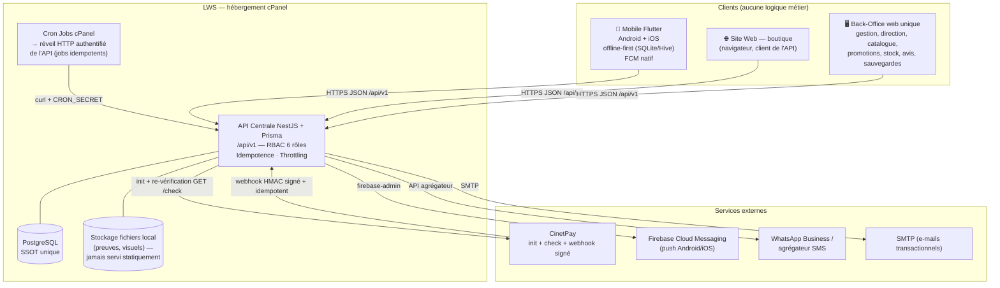

# Livrable 2 — Architecture cible : vue d'ensemble et diagramme global

> Complément direct de l'audit (`00-audit-depot-existant.md`).
> Ce document fixe les décisions structurantes de la refonte et invalide
> explicitement la trajectoire « deux systèmes » de `docs/ARCHITECTURE.md`.

---

## 1. Principe directeur : une donnée, une base, une API, trois clients

```
                    ┌──────────────────────────────────────────┐
                    │            API CENTRALE AGRIM            │
                    │        NestJS + Prisma (/api/v1)         │
                    │   unique gardienne des règles métier :   │
                    │   prix · stock · montants · statuts      │
                    └───────────────┬──────────────────────────┘
                                    │ SQL (Prisma)
                                    ▼
                    ┌──────────────────────────────────────────┐
                    │        PostgreSQL unique (LWS)           │
                    │   un seul schéma, migrations versionnées │
                    └──────────────────────────────────────────┘
                          ▲                ▲              ▲
                          │ HTTPS/JSON     │ HTTPS/JSON   │ HTTPS/JSON
              ┌───────────┴───┐   ┌────────┴───────┐  ┌───┴────────────┐
              │  SITE WEB     │   │  BACK-OFFICE   │  │  MOBILE        │
              │  (boutique)   │   │  (web, staff)  │  │  Flutter       │
              │  client API   │   │  client API    │  │  Android + iOS │
              └───────────────┘   └────────────────┘  └────────────────┘
```

Règles qui découlent de ce principe :

1. **Aucune donnée métier n'est dupliquée entre systèmes.** Il n'existe
   aucune copie de catalogue, aucun compteur de stock parallèle, aucun
   vocabulaire de statuts parallèle — donc **aucune synchronisation**, donc
   aucune fenêtre d'incohérence. C'est l'élimination structurelle (pas
   corrective) des bugs de prix/stock/paiement croisés.
2. **Le navigateur et le mobile sont des terminaux idiots pour le calcul** :
   ils affichent des données servies par l'API et envoient des intentions
   (« je veux commander »), jamais des montants imposés. Tout se recalcul côté
   serveur dans une transaction (prix promu, frais de livraison, remises).
3. **Une règle métier n'a qu'une implémentation** : dans l'API centrale.
   (Les schémas Zod côté back-office et les modèles Dart côté Flutter ne sont
   que des validations d'interface, jamais des décisions.)

### Pourquoi cette base unique est sûre (et pourquoi l'option rejetée ne l'était pas)

L'audit l'a rappelé : `docs/ARCHITECTURE.md` avait raison de rejeter « deux
applications hétérogènes (FastAPI + NestJS) écrivant dans la même base » —
aucun propriétaire des règles, deux mécanismes de migration incompatibles.
La cible n'est **pas** cette option : c'est **un seul backend** (un seul code,
un seul jeu de migrations Prisma versionnées, un seul modèle de statuts)
derrière une base unique. La condition de sécurité de la base partagée — un
seul écrivain logiciel — est ici réunie par construction.

---

## 2. Choix du backend : NestJS retenu (FastAPI écarté)

| Critère | NestJS + Prisma | FastAPI + SQLAlchemy |
| --- | --- | --- |
| Support cPanel/LWS | **« Setup Node.js App » = Passenger Node, supporté nativement par cPanel** (point d'entrée applicatif, redémarrage géré) | Passenger Python = **WSGI** ; FastAPI est ASGI — l'écosystème ASGI sur Passenger mutualisé est fragile (pas d'event loop persistante garantie) |
| Réutilisation de l'existant | **Fort** : 68 routes, machines à états, guards RBAC, providers CinetPay, 243 tests — réutilisables tels quels comme socle | Nul : tout serait réécrit depuis Python du site, dont les 145 routes mélangent front et API |
| Un seul langage bout en bout | TypeScript API + back-office web + tooling | Deux langages (Python + TS web) |
| Migrations | Prisma Migrate versionnées — l'unique gouvernance du schéma | Alembic — reprendrait le schéma SQLite/PG du site, à reconstruire |
| Worker permanent | **Non requis** : Passenger démarre l'app à la requête ; les tâches périodiques sont des crons cPanel qui **réveillent** l'API via HTTP | Idem théoriquement, même conclusion |

**Décision** : NestJS + TypeScript + Prisma + PostgreSQL. Le portage du site
FastAPI vers l'API centrale est traité comme une migration fonctionnelle
(livrable 9), pas comme un maintien en parallèle.

---

## 3. Diagramme d'architecture globale (contexte système)



Version texte (équivalente) :

```
 [Flutter Android/iOS]   [Navigateur boutique]   [Back-Office web staff]
          │                      │                        │
          └──────────── HTTPS /api/v1 (JSON, Bearer JWT) ─┘
                                 │
                     ┌───────────▼────────────┐        ┌──────────────────┐
                     │  API CENTRALE (NestJS) │◄───────│ Cron cPanel      │
                     │  modules métier + RBAC │ curl   │ (jobs idempotents,│
                     └──┬─────────┬────────┬──┘ secret │  secret partagé) │
                        │Prisma   │Storage │           └──────────────────┘
              ┌─────────▼──┐  ┌───▼────┐
              │ PostgreSQL │  │ Disque │        Externes : CinetPay (init/check/
              │  (SSOT)    │  │ local  │          webhook HMAC) · FCM · WhatsApp/
              └────────────┘  └────────┘          SMS · SMTP
```

### Points de conception à noter sur ce diagramme

- **Trois clients, un seul protocole** : HTTPS + JSON + JWT Bearer + version
  d'URL `/api/v1`. Le back-office n'a **aucun** privilège qui ne passe pas
  par un rôle serveur.
- **Le cron réveille l'API au lieu d'exécuter la logique** : la règle métier
  reste dans un seul endroit. Les jobs (expiration de réservations,
  réconciliation paiements, relances paniers abandonnés, purge de rétention)
  sont des `POST /api/v1/jobs/:nom` authentifiés par `CRON_SECRET`,
  **idempotents** et protégés contre le chevauchement par verrou applicatif
  en base — deux déclenchements rapprochés ne produisent jamais un double
  traitement.
- **La messagerie sortante est un module de l'API**, plus un service rendu
  par le site : un seul crédit WhatsApp/SMS, un seul journal — mais dans la
  base unique.
- **CinetPay est appelé et rappelé** : le webhook signé (HMAC, ordre des
  champs — héritage du portage existant) ne fait que *déclencher* ; la vérité
  du paiement est re- interrogée via `GET /v2/payment/check` côté serveur
  (livrable 6).

---

## 4. Cartographie des responsabilités (remplace `ARCHITECTURE.md` §3)

| Domaine | Propriétaire AVANT | **Propriétaire CIBLE** |
| --- | --- | --- |
| Catalogue (gammes, formats, visuels) | Site (back-office) | **API centrale** (écriture via back-office) |
| Prix, promotions | Site | **API centrale** |
| Stock et mouvements | Site (réservations à distance) | **API centrale** (transactions PG + `StockMovement`) |
| Grille / tarifs de livraison | Site | **API centrale** |
| Comptes clients & personnel | Deux annuaires séparés | **API centrale** (un annuaire, 6 rôles RBAC) |
| Commandes | Site (web) **et** app (mobile) | **API centrale** (une commande, quel que soit le canal) |
| Paiements mobile money | App (mobile) / Site (web) | **API centrale** (pipeline unique, multi-canal) |
| Livraisons, tournées, OTP | App | **API centrale** |
| Avis producteurs/produits | Deux fois | **API centrale** |
| Messagerie sortante (SMS/WhatsApp) | Site | **API centrale** (module découplé) |
| Notifications push | App (Expo Push) | **API centrale** (FCM via firebase-admin) |
| Facturation, documents | Site | **API centrale** |
| Rendu des interfaces | Site front + app Expo | **Front web + back-office web + Flutter** — trois renderers purs |

**Invariant de la cible** : *chaque ligne du tableau a un seul propriétaire et
une seule table, dans la même base.* Il n'existe plus de colonne « où vit la
donnée » à deux valeurs.

---

## 5. Flux critiques de bout en bout (aperçu — détaillés aux livrables 5 à 7)

### 5.1 Commande (web **ou** mobile — le même flux)
`POST /orders` avec `Idempotency-Key` → l'API **relit** panier, prix promus,
grille de livraison **dans sa base**, **recalcule tous les montants** dans une
transaction ; décrément de stock par `UPDATE … WHERE stock >= qté` +
écriture `StockMovement` ; `SELECT … FOR UPDATE` sur les variantes en
rareté (anti double-vente du dernier article) ; retourne l'ordre de paiement.

### 5.2 Paiement CinetPay
`POST /payments/:orderId/init` → l'API appelle CinetPay (`/v2/payment`) →
redirection/deep-link vers la page de paiement. CinetPay appelle le
**webhook signé** (`HMAC SHA-256`, ordre des champs vérifié en temps
constant) → l'API **re-vérifie** le statut réel auprès de `/v2/payment/check`
→ écrit `Payment` (idempotence par référence de transaction) → fait passer
la commande `PENDING → CONFIRMED` par transition conditionnelle + événement
d'audit. Aucune écriture de confiance en provenance du client.

### 5.3 Livraison & OTP
Gestion assigne la mission → livreur accepte/démarre → l'API **génère** un
OTP 4 chiffres (`crypto.randomInt`), le **hash** (SHA-256) et l'envoie **au
client uniquement** (push + WhatsApp) → le livreur saisit le code dicté →
l'API compare hash et consomme (usage unique, 5 essais) → `DELIVERED` dans la
même transaction + journal. Le livreur ne peut jamais lire l'OTP, ni clôturer
sans lui (clôture d'exception réservée au rôle GESTIONNAIRE).

### 5.4 Dégradé / hors-ligne (mobile)
Flutter cache catalogue (lecture seule) en SQLite/Hive ; en réseau dégradé la
consultation fonctionne, **mais aucune écriture sensible n'est locale** :
commande et paiement exigent le réseau, avec rejeu idempotent
(`Idempotency-Key` générée une fois par intention, conservée jusqu'au succès).

---

## 6. Ordonnancement — les Cron Jobs cPanel

| Cron (cPanel) | Appelle | Effet |
| --- | --- | --- |
| `*/5 * * * *` (ou plus serré selon offre) | `POST /api/v1/jobs/reconciliation` | Règle les paiements abandonnés (vérification CinetPay), rend le stock des commandes expirées, purge la rétention |
| `*/15 * * * *` | `POST /api/v1/jobs/abandoned-carts` | Relances paniers/notifications (programmé, pas temps réel) |
| Quotidien (nuit) | `POST /api/v1/jobs/maintenance` | Purges, statistiques agrégées, contrôle d'intégrité stock vs journal |

Chaque job : authentifié par en-tête secret, **idempotent**, verrouillé
contre l'exécution simultanée, journalisé en base. Un passage de rattrapage
au démarrage de l'application est conservé (héritage du pattern existant)
pour les hébergements au démarrage paresseux.

---

## 7. Arborescence cible des dépôts

```
agrim/                        # monorepo (hérite de l'actuel agrim-mobile)
├── apps/
│   ├── api/                  # API centrale NestJS + Prisma (socle existant élargi)
│   ├── web/                  # site boutique (client API)
│   └── back-office/          # back-office web unique (client API)
├── packages/
│   └── contracts/            # Zod : DTO, enums, règles d'AFFICHAGE (pas de décision)
└── docs/refonte/             # les 10 livrables de cette conception

agrim-flutter/                # dépôt mobile séparé (outils Dart, publication stores)
└── (lib/, test/, integration_test/)
```

Le mobile reste un dépôt séparé : cycles de publication stores ≠ cycles web,
outillage Dart. Le contrat entre eux est l'API `/api/v1` + sa spec OpenAPI.

---

## 8. Règles transverses non négociables (héritées de la mission)

1. **SSOT** — interdiction d'introduire toute table/cliché/duplicata d'une
   donnée métier dans un client. Tout état local mobile est un **cache de
   lecture** périssable, jamais une écriture.
2. **Le serveur décide** — prix, stock, frais, montants, statuts : recalculés
   serveur à chaque opération sensible ; le client n'impose jamais.
3. **Anti double-vente** — toute écriture concurrente de stock passe par une
   transaction PostgreSQL avec verrou (conditionnel ou `FOR UPDATE`) +
   `StockMovement`. Aucun chemin ne « relit puis écrit ».
4. **Idempotence** — `Idempotency-Key` obligatoire sur `POST /orders`, les
   initiations de paiement, les webhooks et les jobs cron.
5. **Paiement** — le module CinetPay est isolé derrière une interface ; la
   vérité d'un paiement vient du **webhook signé re-vérifié** via l'API
   CinetPay, jamais du client.
6. **OTP** — généré, hashé, distribué et validé par le serveur ; jamais
   exposé au livreur.
7. **Notifications découplées** — le cœur commandes émet des événements
   (`CommandeConfirmée`, `LivraisonEnCours`, …) ; le service de notifications
   y souscrit et choisit les canaux (FCM, WhatsApp, e-mail). Rien n'est
   envoyé depuis un module métier.
8. **RBAC serveur** — les six rôles `CLIENT, LIVREUR, PRODUCTEUR,
   GESTIONNAIRE, ADMIN, DG` sont appliqués par guards globaux, jamais par
   l'interface.

---

## 9. Ce qui change pour chaque acteur

| Acteur | Avant | Cible |
| --- | --- | --- |
| Client | Deux comptes, prix parfois périmés jusqu'à 15 min, paiement mobile uniquement | Un compte, un historique multicanal, prix toujours justes au moment du calcul serveur |
| Gestionnaire | Deux back-offs (site pour le catalogue, app pour les commandes) | **Un back-office unique** : catalogue, stock, commandes tous canaux, livraisons, avis |
| Livreur | App Expo | App Flutter, flux OTP inchangé dans le principe |
| Producteur | App Expo | App Flutter (récoltes, statuts de production) |
| DG / ADMIN | Deux sources de vérité pour le pilotage | Une seule source : l'API centrale (analytics sur données unifiées) |
| Client web du site | Commandes dans une base séparée | Même API, mêmes commandes, même historique |

---

## 10. Prochaines étapes (livrables 3 à 10)

3. Découpage en modules NestJS de l'API centrale (qui absorbe quoi du site).
4. ERD complet PostgreSQL (fusion des 25 modèles existants + les domaines du
   site) avec les contraintes de concurrence explicites.
5. Contrats `/api/v1` (DTO, erreurs normalisées, idempotence, pagination).
6. Module CinetPay détaillé (flux, webhook, sécurité, réconciliation).
7. Workflow livraison & OTP (séquences complètes par rôle).
8. Procédure LWS/cPanel (Passenger Node, `.env`, PostgreSQL, migrations).
9. Migration des données (site → API centrale, sans perte ni interruption).
10. Plan de tests (unitaires, intégration, E2E, concurrence 100 req/sur
    dernier stock, charge).
