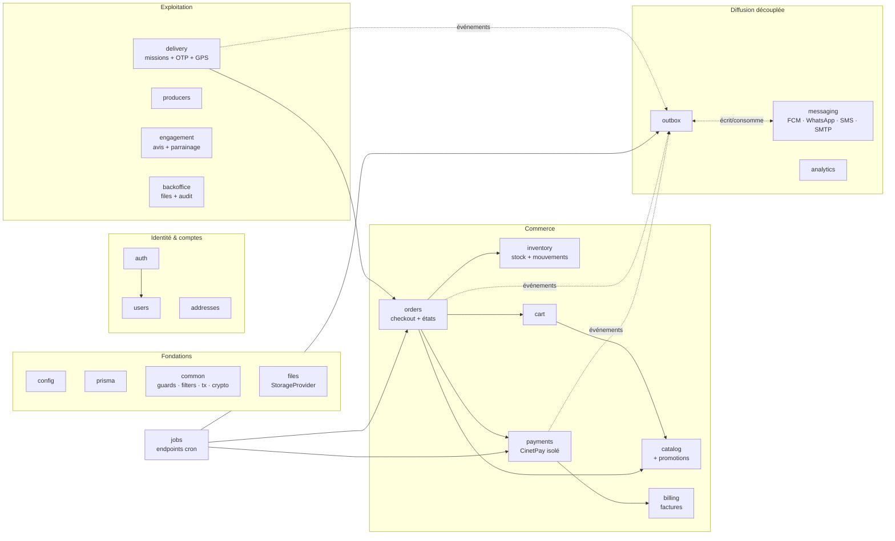
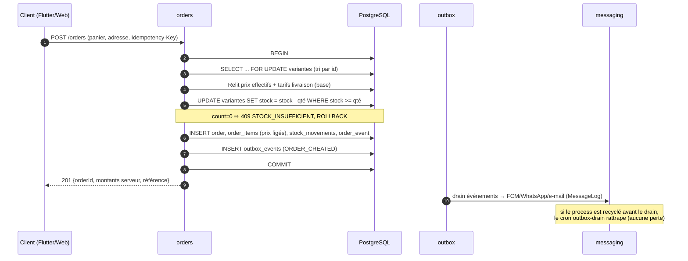

# Livrable 3 — Architecture logicielle backend : modules et responsabilités

> Concerne l'API centrale unique (décision justifiée au livrable 2) :
> **NestJS + TypeScript + Prisma + PostgreSQL**, déployée comme **UNE seule
> application Passenger** sur LWS/cPanel. Le site web, le back-office et
> Flutter sont trois clients HTTP ; ils ne contiennent aucune règle métier.

---

## 1. Style d'architecture : monolithe modulaire (décision motivée)

**Un monolithe modulaire, pas des microservices.** Raisons décisives dans cet
environnement :

| Contrainte | Conséquence |
| --- | --- |
| LWS mutualisé + Passenger (1 app par cPanel, redémarrages à la requête) | Impossible d'exploiter 5–10 services distincts ; un seul process NestJS |
| Pas de broker (RabbitMQ/Kafka) ni de worker permanent | La communication asynchrone passe par la **base** (Outbox transactionnel, § 6), pas par un middleware |
| Une seule base PostgreSQL (SSOT) | Les frontières transactionnelles sont naturelles : une transaction = un cas d'usage |
| Équipe réduite | Un déploiement, un runbook, une pile de logs |

La modularité est **imposée par le compilateur**, pas par la discipline :
chaque module NestJS n'exporte que ses services explicitement publics, et une
règle de revue interdit d'importer les internals d'un autre module.

### 1.1 Les trois couches à l'intérieur d'un module

```
Controller  →  Service (règles métier, transactions)  →  Repository/Prisma
   │                    │
   │ DTO + validation   │ machines à états, verrouillage, journaux
   ▼                    ▼
  HTTP               PostgreSQL (via Prisma)
```

- **Controller** : routing, DTO (schémas Zod de `@agrim/contracts`), guards
  (appliqués globalement), HTTP status. **Aucune logique.**
- **Service** : LE propriétaire des règles. Ouvre les transactions, applique
  les machines à états, écrit les journaux (`OrderEvent`, `StockMovement`,
  `AuditLog`), émet les événements d'Outbox.
- **PrismaService** : accès données. Pas de SQL métier ailleurs.

### 1.2 Règles transverses (cross-cutting)

| Sujet | Règle | Porteur |
| --- | --- | --- |
| Authentification | JWT access 15 min + refresh 30 j **avec rotation et révocation** (design existant conservé) | `JwtAuthGuard` global |
| Autorisation | RBAC 6 rôles, `@Roles()` par route, refus par défaut | `RolesGuard` global |
| Débit | Throttling par IP+route (existant) | `ThrottlerGuard` global |
| Erreurs | Enveloppe standardisée unique (livrable 5, § 5) | `HttpExceptionFilter` |
| Validation | Tout payload entre par un schéma Zod ; refus 400 avec détail | `ZodValidationPipe` |
| Idempotence | Interceptor `Idempotency-Key` → table `IdempotencyRecord` (rejeu = réponse figée, jamais un second effet) | `IdempotencyInterceptor` |
| Transactions | `TxRunner.run(tx => …)` — toutes les écritures multi-tables passent par lui ; isolation par défaut READ COMMITTED, `SERIALIZABLE`/`FOR UPDATE` là où exigé | `common/tx` |
| Verrouillage stock | `withStockLock(tx, variantIds[])` : `SELECT … FOR UPDATE` trié par id (anti-deadlock) | `common/stock` |
| Montants | **Entiers XOF**, jamais de flottant ; recalcul systématique serveur | `@agrim/contracts` + services |
| Horodatage | `timestamptz` UTC partout | Prisma |

---

## 2. Carte des modules



*(les flèches pleines = dépendances de services exportés ; pointillés =
événements via Outbox — jamais d'appel direct du métier vers l'envoi de
notifications).*

---

## 3. Responsabilités module par module

### 3.1 Fondations

| Module | Responsabilité | Contenu clé |
| --- | --- | --- |
| `config` | Validation stricte des `.env` au démarrage (design existant conservé : secrets faibles ⇒ refus de démarrer en prod) | `env.validation.ts` |
| `prisma` | Client Prisma singleton, pool calibré mutualisé (faible), timeouts | `PrismaService` |
| `common` | Guards globaux, filtre d'erreurs, `TxRunner`, `withStockLock`, chiffrement AES-256-GCM au repos (OTP), utilitaires pagination, génération de références | `guards/`, `filters/`, `interceptors/`, `crypto/`, `stock/`, `tx/` |
| `files` | Interface `StorageProvider` + pilote disque local (persistant sous cPanel). Preuves et PDF **jamais servis en statique** : lecture authentifiée avec contrôle d'accès | `storage.module` (existant conservé) |
| `jobs` | Endpoints `POST /api/v1/jobs/:nom` pour Cron cPanel : auth `CRON_SECRET`, **idempotence**, exclusion mutuelle via `JobRun` (index partiel unique sur job actif). Jobs : `reconciliation`, `abandoned-carts`, `outbox-drain`, `maintenance` | nouveau (remplace les `setInterval`) |

### 3.2 Identité & comptes

| Module | Responsabilité | Héritage |
| --- | --- | --- |
| `auth` | Inscription/connexion téléphone+mot de passe, JWT + rotation refresh, verrouillage anti-bruteforce, lien FCM (`PushToken`) | **Conservé tel quel** (243 tests l'éprouvent) ; s'ouvre aux clients web (e-mail en login alternatif) |
| `users` | Administration des comptes (back-office), dédoublonnage par téléphone, désactivation, réinitialisation | Étendu : absorbe la gestion `utilisateurs` du site |
| `addresses` | Adresses « ivoiriennes » (GPS + repères) | **Conservé tel quel** |

### 3.3 Commerce — le cœur du SSOT

| Module | Responsabilité | Héritage / nouveauté |
| --- | --- | --- |
| `catalog` | Gammes (`Category`), produits, variantes (formats), **visuels (galerie)**, **promotions** (règles datées → prix effectif serveur). Écriture réservée GESTIONNAIRE/ADMIN/DG ; lecture publique pour web + mobile | Refondé : était une **copie** synchronisée du site ; devient propriétaire. Absorbe catalogue + promotions + galerie du back-office site |
| `inventory` | Stock des variantes, **journal `StockMovement` obligatoire et simultané**, entrées/sorties/ajustements (motif obligatoire sur ajustement), seuils d'alerte, consultation basse | Refondé : était partagé avec le site (réservations à distance). Le décrément conditionnel et la restitution par transition conditionnelle (pattern P0) sont **conservés** ; la saga de réservation distante est **supprimée** |
| `cart` | Panier serveur par utilisateur (le panier mobile n'est qu'un cache de lecture de ce panier) | Conservé ; + `lastReminderAt` pour le cron paniers abandonnés |
| `orders` | **Checkout serveur** : relecture panier, prix effectifs, grille de livraison (`CompanySetting`/table de tarifs), recalcul intégral des montants en transaction ; création avec `Idempotency-Key` ; machine à états `PENDING → … → DELIVERED/CANCELLED` avec transitions conditionnelles + `OrderEvent` ; annulation client et bureau avec restitution de stock arbitrée (point de passage unique conservé) | **Conservé et élargi** : les commandes **web** (ex-site) passent par le même pipeline. C'est la fin des deux vocabulaires de statuts |
| `payments` | Port `PaymentProvider` + providers **CinetPay / PayDunya / Simulation** ; initiation idempotente ; **webhook signé** (dédié au livrable 6) ; re-vérification `check` ; réconciliation des abandons | Conservé (isolation déjà excellente) ; élargi aux paiements web |
| `billing` | Factures : numérotation `FAC-AAAA-NNNNN`, PDF généré serveur (pdf-kit) stocké via `StorageProvider`, re-téléchargement client | **Nouveau** (absorbe facturation du site) |

### 3.4 Exploitation

| Module | Responsabilité | Héritage / nouveauté |
| --- | --- | --- |
| `delivery` | Missions, affectation (anti-course), machine à états livreur, **OTP 4 chiffres** (génération serveur, SHA-256 + AES-GCM, 5 essais, usage unique, clôture d'exception GESTIONNAIRE), trace GPS rejouable, réessai après échec | **Conservé intégralement** — conforme à la lettre aux exigences |
| `producers` | Producteurs, exploitations, déclarations de récolte (`DECLARED → CONFIRMED → RECEIVED/REJECTED` — un producteur ne valide jamais sa propre déclaration) | Conservé |
| `engagement` | Avis produit (1 par couple client/produit), **parrainage** (code, filleul, récompense unique) + **registre de crédits** (`CreditTransaction`, nouveau : solde traçable) | Conservé + registre ajouté |
| `backoffice` (ops) | Files du gestionnaire (commandes à préparer, livraisons à affecter, stock bas), clôtures d'exception, audit global `AuditLog` (absorbe le journal du site), sauvegardes déclenchées (dump SQL via cron — livrable 8) | Refondu : fusionne l'espace « gestion/direction » de l'app et le back-office du site en **un seul client web** des mêmes API |

### 3.5 Diffusion découplée — le point exigé « notifications découplées »

Le cœur métier **n'appelle jamais** FCM, WhatsApp, SMS ou SMTP. Il écrit un
événement ; la diffusion est un consommateur :

```
Transaction métier                    Diffusion
─────────────────────                 ─────────────────────────────────
BEGIN                                 (après commit, en ligne, best-effort)
  UPDATE orders …                       Dispatcher lit OutboxEvent non traités
  INSERT StockMovement …                → pour chaque événement :
  INSERT OrderEvent …                       résout destinataires + canaux
  INSERT OutboxEvent(                       (règles par type + préférences)
    type='ORDER_CONFIRMED',                 → FCM (firebase-admin)
    payload={orderId,…})                    → WhatsApp/SMS (agrégateur)
COMMIT                                      → SMTP (e-mails transactionnels)
                                            écrit MessageLog + Notification
                                        (marque traité ; retry par cron
                                         `outbox-drain` si le process
                                         Passenger est recyclé entre-temps)
```

**Pourquoi un Outbox en base plutôt qu'un EventBus mémoire** : Passenger
recycle les process ; un événement perdu en mémoire est une notification
perdue, un événement en base est une notification **en retard**. L'écriture
de l'événement dans la **même transaction** que l'effet métier garantit
qu'aucun ordre confirmé n'existe sans son événement, et inversement.

| Module | Responsabilité |
| --- | --- |
| `outbox` | Écriture (`OutboxService.emit(type, payload)` — appelé DANS la transaction), lecture/drain, retries avec back-off, purge |
| `messaging` | Quatre ports derrière une interface : `PushPort` (FCM natif, remplace Expo Push), `WhatsappPort` + `SmsPort` (agrégateur direct — plus de relais par le site), `MailPort` (SMTP LWS). Journal `MessageLog` (statuts, erreurs), templates de messages versionnés. Résolution « événement → canaux → destinataires » |
| `analytics` | Agrégats lecture seule (ventes, annulations, délais de livraison, taux d'OTP vs override) pour l'espace DG/ADMIN — requêtes sur la base unique, plus aucune vue croisée à réconcilier |

### 3.6 Modules conservés sans changement notable

`health` (sonde Passenger), `legal` (CGV/mentions), `reviews` et `referrals`
(rattachés à `engagement`), `storage` (→ `files`).

---

## 4. Absorption des 145 routes du site — tableau de correspondance

| Domaine fonctionnel du site (FastAPI) | Destination dans l'API centrale |
| --- | --- |
| Catalogue public (gammes, produits) | `catalog` — mêmes données, endpoints `/api/v1/catalog/*` |
| Back-office catalogue/promotions/galerie | `catalog` (écriture RBAC) + back-office web |
| Commandes web + statuts `en_attente_paiement…` | `orders` — même machine à états, traduction des anciens statuts à la migration (livrable 9) |
| Clients (`clients`) | `users` — fusion par téléphone |
| Factures PDF | `billing` |
| Avis (`avis`) | `engagement` (modèle `ProductReview` déjà plus contraint : 1 avis/client/produit) |
| Messagerie SMS/WhatsApp | `messaging` (port direct agrégateur — le relais disparaît) |
| Journal d'audit | `AuditLog` (unifié avec `OrderEvent` pour les commandes) |
| Sauvegardes | Cron cPanel `pg_dump` (livrable 8) + `backoffice` |
| Paramètres (`config.py`) | `CompanySetting` + table de tarifs de livraison |
| Grille de livraison (`POST /api/integration/prix`) | `orders` (tarifs lus en base au checkout) |
| Réservations de stock (`reserver/confirmer/liberer`) | **Supprimées** — la transaction locale les rend inutiles |
| `GET /api/integration/catalogue` / `POST /api/integration/message` | **Supprimés** — plus de consommateur |

---

## 5. Arborescence cible

```
apps/api/src/
├── main.ts · bootstrap.ts · app.module.ts
├── config/                 # validation .env
├── prisma/                 # PrismaService, migrations/
├── common/
│   ├── guards/             # jwt-auth, roles, cron-secret
│   ├── interceptors/       # idempotency
│   ├── filters/            # http-exception (enveloppe standard)
│   ├── tx/                 # TxRunner
│   ├── stock/              # withStockLock, décrément conditionnel, restitution
│   ├── crypto/             # AES-256-GCM au repos
│   └── pagination/, transforms/
├── auth/  users/  addresses/
├── catalog/                # products, variants, categories, promotions, media
├── inventory/              # stock admin + movements
├── cart/
├── orders/                 # checkout, états, annulation, tarifs livraison
├── payments/               # payment.provider + providers/{cinetpay,paydunya,simulation}
├── billing/                # factures PDF
├── delivery/               # missions, otp, tracking
├── producers/
├── engagement/             # reviews, referrals, credit
├── messaging/              # push/ fcm, whatsapp/, sms/, mail/ + dispatcher
├── outbox/
├── backoffice/             # files ops, audit, sauvegardes
├── analytics/
├── jobs/                   # endpoints cron cPanel
├── files/  health/  legal/
packages/contracts/         # Zod : DTO + règles d'affichage partagées TS
```

**Dépendances interdites** : un module métier n'importe jamais
`messaging/` ni `payments/providers` directement (il passe par `outbox` et le
port `PaymentProvider`) ; `common` n'importe aucun module métier ; seuls
`orders`/`inventory` écrivent le stock — et toujours via `common/stock`.

---

## 6. Ce qui disparaît du backend actuel (récapitulatif)

| Élément supprimé | Remplacé par |
| --- | --- |
| `catalog-sync` (pull 15 min, requote prix, grille distante) | `catalog` propriétaire + tarifs en base |
| Variables `SITE_INTEGRATION_*` | Néant (couplage supprimé) |
| `setInterval` in-process (2 modules) | `jobs/` + Cron cPanel (idempotents, verrouillés) |
| Saga de réservation distante (`réserver → tx → confirmer`) | Transaction locale unique avec verrous PG |
| Expo Push | FCM via firebase-admin (`messaging/push`) |
| Relais SMS/WhatsApp via le site | Ports directs agrégateur (`messaging`) |

---

## 7. Séquence type — création de commande (le motif à retenir)



Le même motif vaut pour web et mobile : **il n'existe qu'un seul chemin
d'écriture par concept**, c'est cela qui rend la SSOT tenable.
