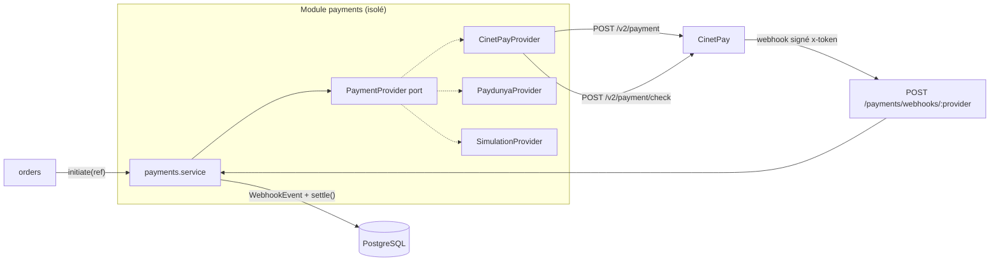
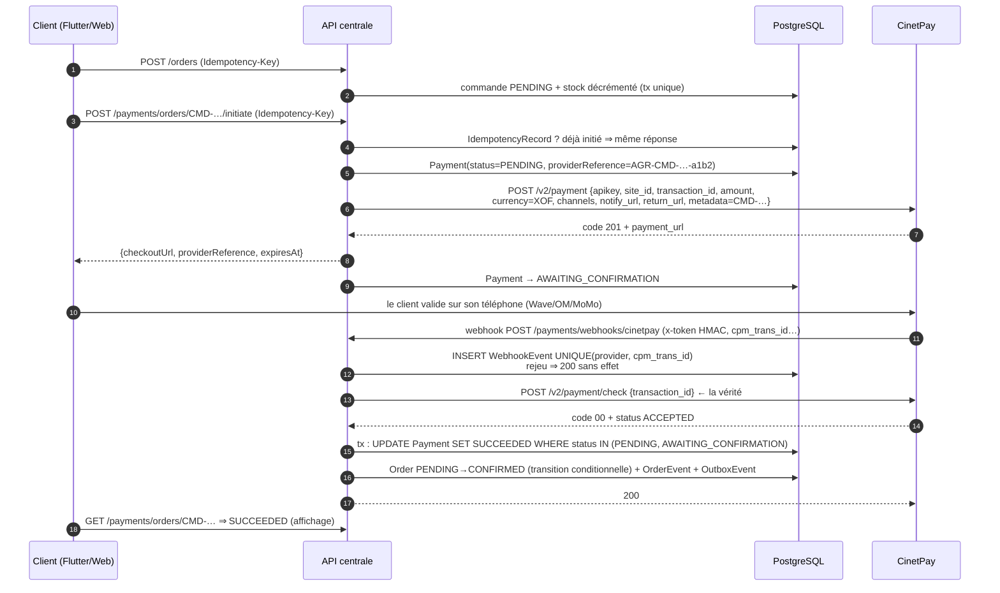

# Livrable 6 — Architecture du module CinetPay (paiements)

> Objectif : un module de paiement **isolé**, où aucun montant ni statut ne
> peut être imposé de l'extérieur, où chaque webhook est **authentifié,
> re-vérifié et idempotent**, et où une panne ou un rejeu de l'opérateur ne
> produit jamais de double encaissement ni de commande perdue.
> Le socle existant est **de haute qualité** (portage de `paiement.py` du site,
> corrections de production documentées) : il est conservé et durci.

---

## 1. Principes non négociables

1. **Isolation** : seul le module `payments` connaît CinetPay. Le reste de
   l'application ne voit que le port `PaymentProvider` (interface abstraite
   existante conservée à l'identique).
2. **Le webhook ne fait pas foi** : `callbackIsProof = false` pour tous les
   pilotes réels. Un succès **annoncé** est reconfirmé auprès de
   `POST /v2/payment/check` avant toute écriture définitive.
3. **Idempotence à trois étages** : (a) dédoublonnage du webhook en base,
   (b) règlement par transition conditionnelle, (c) initiation protégée par
   `Idempotency-Key`.
4. **Le client ne déclare jamais un paiement** : Flutter affiche le statut
   servi par `GET /payments/orders/:ref` ; toute route « le paiement est bon »
   côté client n'existe pas.
5. **Toujours répondre 200 au webhook** (hors signature invalide au sens
   protocolaire) : une erreur renvoyée déclenche une tempête de rejeux ; les
   anomalies sont journalisées, pas retournées.
6. **Montants entiers XOF**, portés par l'API à partir de la commande — le
   corps de la requête d'initiation ne contient aucun montant.

---

## 2. Vue d'ensemble du module

```
apps/api/src/payments/
├── payments.module.ts
├── payments.controller.ts       # initiate, status, webhook
├── payments.service.ts          # orchestration, machines à états
├── payment.provider.ts          # PORT (interface) — conservé
├── transaction-reference.ts     # réf. opérateur unique dérivée de la commande
├── http-json.ts                 # timeouts bornés, lecture tolérante
└── providers/
    ├── cinetpay.provider.ts     # le seul à connaître CinetPay
    ├── paydunya.provider.ts     # secours (bascule par .env)
    └── simulation.provider.ts   # tests (seul callbackIsProof=true)
```



---

## 3. Flux nominal complet



Points clés de la séquence :

- **`transaction_id` est dérivé de la référence de commande** (`transaction-reference.ts`)
  : nous choisissons notre référence, jamais l'opérateur — c'est la clé de
  correspondance dans les deux sens.
- **`metadata = référence de commande`** : le webhook CinetPay renvoie
  `metadata`, ce qui permet de retrouver la commande sans parser un libellé.
- **`return_url`** ne fait qu'envoyer le client sur son écran de suivi ; elle
  ne porte **aucune** information de statut.
- Le règlement (`settle`) est le **seul** chemin d'écriture du succès — webhook
  et réconciliation convergent vers lui (héritage existant, conservé).

---

## 4. Sécurisation du webhook

### 4.1 Authentification : HMAC-SHA256 sur 16 champs ordonnés

Le jeton arrive dans l'en-tête `x-token` ou le champ `signature` du corps
(selon configuration marchand CinetPay). La vérification (héritée, avec les
« leçons » de production) :

1. **Ordre exact des champs signés** — partie du protocole, toute permutation
   invalide tout : `cpm_site_id, cpm_trans_id, cpm_trans_date, cpm_amount,
   cpm_currency, signature, payment_method, cel_phone_num, cpm_phone_prefixe,
   cpm_language, cpm_version, cpm_payment_config, cpm_page_action,
   cpm_custom, cpm_designation, cpm_error_message`.
2. Concaténation des valeurs dans cet ordre, HMAC-SHA256 avec
   `CINETPAY_SECRET`, comparaison **en temps constant** (`timingSafeEqual`)
   sur des empreintes — jamais de `===` sur des secrets.
3. **`CINETPAY_SECRET` est requis au même titre que la clé et le site id** —
   sans lui, la configuration est déclarée invalide au démarrage
   (`isConfigured()`). *Leçon documentée : une config incomplète rejetait
   100 % des callbacks et les commandes payées restaient en attente.*
4. Vérification que `cpm_site_id` = notre site et que `cpm_amount` = montant
   du `Payment` local — un webhook pour une autre transaction de notre
   propre site_id est rejeté (`status: IGNORED`).

### 4.2 Idempotence : `WebhookEvent`

```sql
CREATE UNIQUE INDEX webhook_dedup ON "WebhookEvent" ("provider", "externalId");
```

Traitement :

```
INSERT INTO WebhookEvent (provider, externalId=cpm_trans_id, payload, signatureValid)
  — contrainte unique :
     → déjà présent ⇒ journalement "rejeu", répond 200, NE FAIT RIEN.
  — insertion OK :
     signature invalide ⇒ status REJECTED, 200, alerte.
     signature valide   ⇒ re-vérification /check ⇒ settle() ⇒ status PROCESSED.
```

Le payload brut est conservé (12 mois) : toute litige se règle sur les
octets reçus, pas sur notre reconstruction.

### 4.3 Vérification active (`/check`) — la seule source de vérité

| Réponse CinetPay | Lecture | Effet |
| --- | --- | --- |
| `code=00` et `status=ACCEPTED` | `PAID` | `settle(SUCCEEDED)` |
| `status ∈ {REFUSED, CANCELED, EXPIRED}` | `FAILED` | `settle(FAILED)` — annule la commande, rend le stock |
| tout autre cas | `PENDING` | aucun changement ; la réconciliation repassera |

Un échec explicite **ne laisse jamais la commande en attente indéfinie** :
elle est annulée et le stock rendu (comportement existant conservé).

### 4.4 Matrice de robustesse

| Situation | Comportement |
| --- | --- |
| Webhook jamais envoyé (panne opérateur) | Réconciliation (cron) : toute `AWAITING_CONFIRMATION` au-delà de la fenêtre est re-vérifiée via `/check`, puis réglée ou expirée |
| Webhook rejoué | Dédoublonné par `WebhookEvent` |
| Deux webhooks (échec puis succès) | Ordre quelconque : `settle` n'accepte que la transition depuis statuts non finaux ; le second est sans effet |
| `/check` injoignable | `PAYMENT_GATEWAY_UNAVAILABLE` 503 au client ; le paiement reste en attente ; réconciliation repasse |
| Process recyclé entre webhook et settle | Le webhook a déjà répondu ? Non : la réponse 200 n'est envoyée qu'après le settle — sinon CinetPay rejoue (c'est voulu). Et si le settle s'est fait mais pas la réponse, le rejeu est dédoublonné |
| Montant webhook ≠ montant commande | `IGNORED` + alerte (tentative de manipulation) |
| Passage CinetPay indisponible | Bascule `Paydunya` par variable d'environnement — même port, zéro changement métier |

---

## 5. Idempotence du règlement — `settle()`

```
settle(paymentId, résultat, message):
  tx {
    payment = SELECT … FOR UPDATE
    si payment.status déjà final (SUCCEEDED/FAILED/EXPIRED/REFUNDED) : retour (déjà réglé)
    UPDATE Payment SET status=résultat WHERE status IN (PENDING, AWAITING_CONFIRMATION)
    si résultat == SUCCEEDED :
        Order → CONFIRMED par UPDATE conditionnel (PENDING uniquement)
        OrderEvent + OutboxEvent(ORDER_CONFIRMED, PAYMENT_SUCCEEDED)
    sinon :
        arbitrer l'annulation (transition conditionnelle vers CANCELLED)
        restitution du stock PAR LE MÊME JETON (pattern P0 conservé)
        OutboxEvent(PAYMENT_FAILED / ORDER_CANCELLED)
  }
  → l'appelant (webhook, réconciliation, re-vérification client) ne peut
    jamais doubler : la condition SQL est le jeton d'exclusion.
```

Résultat renvoyé `settled: boolean` — le perdant de la course journalise,
sans réécrire.

---

## 6. Machine à états `Payment`

```
PENDING ──initiation ok──► AWAITING_CONFIRMATION ──check ACCEPTED (webhook ou cron)──► SUCCEEDED
   │                              │
   │ initiation échec             ├─check REFUSED/CANCELED──► FAILED ──► Order CANCELLED + stock rendu
   ▼                              └─délai dépassé───────────► EXPIRED ─► idem
 FAILED (Order CANCELLED + stock rendu)

SUCCEEDED ──(remboursement back-office, opération manuelle tracée)──► REFUNDED
```

Transitions **conditionnelles obligatoires** (aucune écriture inconditionnelle
de statut, jamais). `lastCheckedAt`/`attempts` tracent chaque re-vérification.

---

## 7. Configuration et secrets (.env)

| Variable | Rôle | Note |
| --- | --- | --- |
| `CINETPAY_API_KEY`, `CINETPAY_SITE_ID`, `CINETPAY_SECRET` | triplet marchand | les trois requis ; démarrage refusé sinon (prod) |
| `PAYMENT_PROVIDER` | `cinetpay` \| `paydunya` \| `simulation` | bascule sans redéploiement du code |
| `PAYMENT_TIMEOUT_SECONDS` | timeout borné des appels opérateur | défaut conservé |
| `PUBLIC_API_URL` | construit `notify_url` | doit être HTTPS public (webhook joignable depuis Internet) |
| `PUBLIC_WEB_URL` | construit `return_url` (écran de suivi) | |

Le secret CinetPay ne quitte jamais le serveur ; aucune donnée de paiement
n'est journalisée dans les logs applicatifs (seulement références et statuts).

---

## 8. Ce que le module ne fait pas (garde-fous d'architecture)

- Aucune route client « marquer comme payé ».
- Aucun calcul de montant dans le corps des requêtes clients (l'initiation
  prend une **référence de commande**, pas un montant).
- Aucune écriture de commande hors `settle()`/machines à états.
- Aucune dépendance de `payments` vers `messaging` ou `delivery` — tout
  passage par l'`OutboxEvent`.
- Aucun appel réseau opérateur **à l'intérieur d'une transaction de base**
  (règle héritée de la saga : verrous courts, appels externes hors tx).

---

## 9. Tests dédiés (détail au livrable 10)

| Famille | Cas couverts |
| --- | --- |
| Unitaires provider | signature valide/invalide/permutée, montant incohérent, `check` → lecture des statuts, timeout |
| Intégration service | webhook rejeu (dédoublonné), échec→succès, succès double, expiration, restitution stock |
| Concurrence | webhook + réconciliation simultanés sur le même paiement : **un seul** settle gagne |
| E2E | parcours complet avec `SimulationProvider` : commande → initiation → callback signé → re-vérif → CONFIRMED → événement outbox |
| Réseau dégradé | `/check` en 503 : commande reste en attente, réconciliation rattrape |
