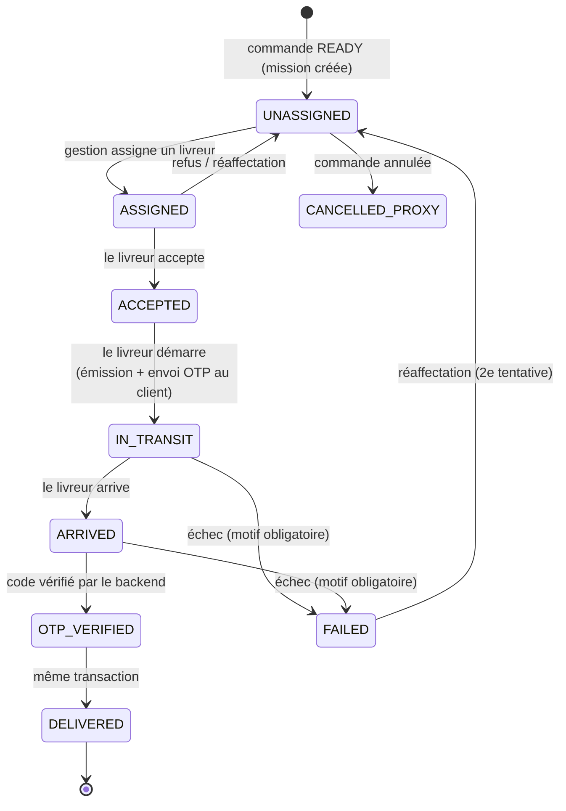
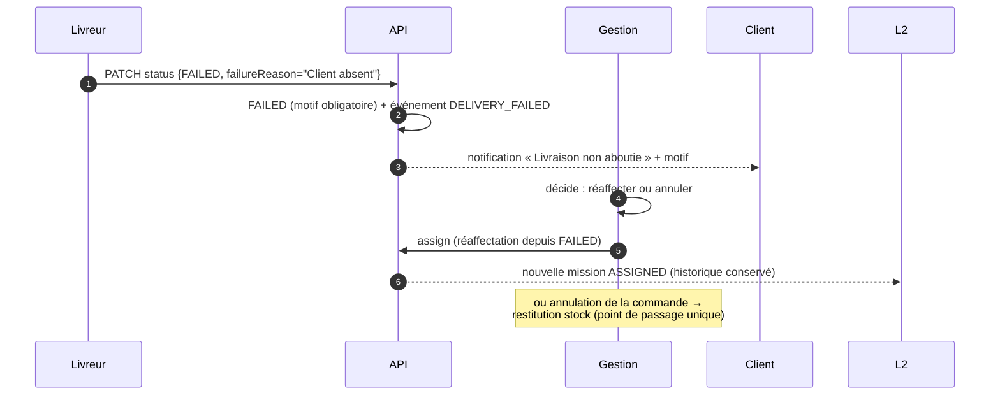

# Livrable 7 — Workflow complet de Livraison & OTP

> De l'assignation de la mission à la clôture de la livraison, pour les trois
> acteurs : **GESTIONNAIRE** (pilote), **LIVREUR** (exécute), **CLIENT**
> (atteste par son code). Le design est hérité de
> `docs/VALIDATION-LIVRAISON-OTP.md` — le plus abouti du dépôt — et porté
> à l'identique dans l'API centrale (messaging FCM/WhatsApp au lieu d'Expo).

---

## 1. Les machines à états

### 1.1 Cycle de livraison (`Delivery`)



Guards appliqués côté serveur (hérités, inchangés) :

| Transition | Conditions | Erreur sinon |
| --- | --- | --- |
| → `ASSIGNED` | livraison `UNASSIGNED`/`ASSIGNED`/`FAILED` (réaffectation) ; cible de rôle `LIVREUR` active | `409 DELIVERY_ALREADY_ASSIGNED` |
| → `ACCEPTED` | livreur **est** l'assigné | `403` |
| → `IN_TRANSIT` | `ACCEPTED` uniquement (pas de saut `ASSIGNED → IN_TRANSIT`) | `409 INVALID_TRANSITION` |
| → `ARRIVED` | `IN_TRANSIT` | `409 INVALID_TRANSITION` |
| → `OTP_VERIFIED` | **cinq conditions OTP** (§ 4) — aucun autre chemin | `OTP_INVALID`/`OTP_EXPIRED`/`OTP_LOCKED` |
| → `DELIVERED` | `OTP_VERIFIED` (même transaction que la vérification) | `409 INVALID_TRANSITION` |
| → `FAILED` | `IN_TRANSIT`/`ARRIVED` + `failureReason` obligatoire | `400` |
| Statuts posables par le livreur | `ASSIGNED→ACCEPTED→IN_TRANSIT→ARRIVED→FAILED` seulement ; `OTP_VERIFIED`/`DELIVERED` **hors de portée** (`COURIER_CANNOT_SET_STATUS` 403) | `403` |

`FAILED` est le **seul mouvement à rebours** (vers une réaffectation) : il
décrit un fait, il ne contourne pas la machine.

### 1.2 Lien avec la commande

La mission naît quand la commande atteint `READY` (préparation terminée) et
se clôt en `DELIVERED` **et** `OrderStatus.DELIVERED` dans la même
transaction — jamais l'un sans l'autre. L'annulation client/gestion après
départ de course passe par la gestion (rappel du stock via le point de
passage unique).

---

## 2. Séquence nominale de bout en bout

```mermaid
sequenceDiagram
    autonumber
    participant G as Gestionnaire (back-office)
    participant A as API centrale
    participant L as Livreur (Flutter)
    participant C as Client (Flutter)
    participant M as messaging (FCM/WhatsApp)

    A->>A: Order READY ⇒ Delivery UNASSIGNED
    G->>A: POST /deliveries/orders/:ref/assign {courierId}
    A->>A: UPDATE conditionnel (anti-course)
    A-->>G: ASSIGNED
    A->>M: événement DELIVERY_ASSIGNED → push livreur
    L->>A: PATCH /deliveries/:id/status {ACCEPTED}
    A-->>L: acceptedAt horodaté
    L->>A: PATCH /deliveries/:id/status {IN_TRANSIT}
    A->>A: génération OTP (crypto.randomInt, 4 chiffres)
    A->>A: codeHash=SHA-256 + codeCipher=AES-256-GCM (TTL 60 min)
    A->>M: notification client : « Votre code est dans le suivi »<br/>(JAMAIS le code dans la notif)
    A-->>L: IN_TRANSIT (sans aucune information de code)
    loop pendant la course (réseau disponible)
        L->>A: POST /deliveries/locations (batch de points)
        A->>A: dédoublonnage (deliveryId, recordedAt)
    end
    L->>A: PATCH /deliveries/:id/status {ARRIVED}
    C->>A: GET /deliveries/orders/:ref/otp (propriétaire, no-store)
    A-->>C: « 4 8 2 1 » (affiché groupé, dictable)
    L->>C: le client DICTE le code sur place
    L->>A: POST /deliveries/:id/verify-otp {code}
    A->>A: les 5 conditions + consommation atomique
    A->>A: tx : OTP_VERIFIED + DELIVERED (order) + GPS de remise<br/>+ OrderEvent + OutboxEvent
    A-->>L: livré ✔
    A->>M: ORDER_DELIVERED → client ; mission clôturée → livreur
```

---

## 3. Étapes détaillées par acteur

### 3.1 Assignation — GESTIONNAIRE/ADMIN/DG (`POST /deliveries/orders/:reference/assign`)

- Liste des livreurs actifs avec charge courante (missions non terminées).
- **Anti-course conservée** : l'affectation est un `UPDATE` conditionnel
  (statut `UNASSIGNED`/`FAILED` attendu) ; deux gestionnaires qui cliquent en
  même temps → un gagnant, l'autre reçoit `409 DELIVERY_ALREADY_ASSIGNED`.
- Réaffectation possible depuis `ASSIGNED` (erreur d'affectation) et `FAILED`
  (seconde tentative) — avec conservation de l'historique des affectations
  (`assignedAt` mis à jour, missions précédentes lisibles dans l'audit).
- Notification push au livreur désigné (événement `DELIVERY_ASSIGNED`).

### 3.2 Exécution — LIVREUR

Le parcours Flutter impose l'ordre machine (boutons conditionnés au statut) ;
le serveur revalide chaque étape. Le livreur dispose de :

- `GET /deliveries/mine` — ses missions actives et passées ;
- `PATCH /deliveries/:id/status` — les 4 transitions autorisées ;
- `POST /deliveries/locations` — envoi **par batch** des points GPS captés
  hors ligne (`recordedAt` = horodatage de la mesure, pas de la réception) ;
- `POST /deliveries/:id/verify-otp` — le seul chemin vers `DELIVERED` ;
- `PATCH /deliveries/:id/status {FAILED}` — motif obligatoire (client absent,
  adresse introuvable, refus…).

**Le livreur n'a aucun écran ni route de validation manuelle.** Le champ de
saisie du code n'apparaît dans l'UI qu'à l'état `ARRIVED`.

### 3.3 Client — réception et révélation du code

- Réception du push « Votre commande est en route — votre code vous attend
  dans le suivi » (le message ne contient **jamais** le code : un push
  s'affiche sur l'écran verrouillé, sous les yeux du livreur qui attend).
- `GET /deliveries/orders/:reference/otp` : réservé au propriétaire, statuts
  `IN_TRANSIT`/`ARRIVED` seulement, réponse `Cache-Control: no-store`,
  jamais mise en cache (gcTime 0 côté Flutter).
- Affichage en grand, groupé (« 48 21 »), libellé d'accessibilité chiffre par
  chiffre (« 4 8 2 1 » — sinon `4821` serait lu « quatre mille huit cent
  vingt et un »), consigne : **à la remise uniquement, jamais par téléphone à
  l'avance**.
- Bouton « Je n'ai pas reçu mon code » → `POST …/otp/resend` (propriétaire
  seulement, statuts `IN_TRANSIT`/`ARRIVED`).

---

## 4. Le code OTP — cycle de vie complet

| Propriété | Valeur | Garde-fou |
| --- | --- | --- |
| Émission | à la transition `IN_TRANSIT` (départ réel de course) | un seul code actif — index partiel unique en base |
| Génération | `crypto.randomInt` (CSPRNG), **chaîne** de 4 chiffres (`0007` valide) | jamais `Math.random()` |
| Stockage | `codeHash` = SHA-256 (vérification) + `codeCipher` = AES-256-GCM (relecture par le propriétaire) | clés distinctes (`ENCRYPTION_KEY` ≠ secrets JWT) |
| Durée de vie | 60 min | régénération sans friction |
| Tentatives | 5 par code ; échec **incrémenté avant réponse** | `OTP_LOCKED` (429) à épuisement |
| Renvois | 5 max, 60 s minimum entre deux | `OTP_RESEND_THROTTLED` (429) |
| Consommation | atomique (`UPDATE … WHERE verifiedAt IS NULL`) | deux requêtes simultanées avec le bon code n'en valident qu'une |
| Invalidation | toute régénération invalide l'actif, dans la même transaction | |

**Algorithme de vérification — les cinq conditions contrôlées ensemble** :

```
verify-otp(livreur, deliveryId, code):
  1. livraison appartient au livreur authentifié        → 403 sinon
  2. statut = ARRIVED                                   → 409 DELIVERY_NOT_ARRIVED
  3. code actif existe, non expiré                      → 410 OTP_EXPIRED
  4. tentatives < 5                                     → 429 OTP_LOCKED
  5. SHA-256(code saisi) == codeHash                    → 400 OTP_INVALID (attempts++)
     ⇒ consommation atomique + tx : OTP_VERIFIED, Order DELIVERED,
       GPS de remise (si disponible), OrderEvent, OutboxEvent(ORDER_DELIVERED)
```

La comparaison d'empreintes et l'incrément **avant** réponse ferment la
saisie automatisée (10 000 combinaisons, 5 essais ⇒ 0,05 % au hasard).

### Pourquoi le livreur ne peut JAMAIS connaître le code — quatre barrières indépendantes

1. **Contrat** : le type des statuts posables exclut `OTP_VERIFIED`/`DELIVERED`
   — impossible à écrire côté mobile.
2. **Backend** : routes livreur sans le code (`otp-status` renvoie l'état, les
   tentatives restantes — pas la valeur).
3. **Chiffrement au repos** : le code n'est lisible en clair nulle part ; seul
   le propriétaire de la commande peut le déchiffrer, à la demande.
4. **Journaux propres** : aucun log applicatif ne contient la valeur (vérifié
   sur exécution réelle : 0 occurrence) ; les notifications stockées non plus
   (défaut de la première version corrigé et purgé).

Le code de secours « dicté par la gestion » a été **écarté** : il recréait
exactement la fuite que le chiffrement ferme.

---

## 5. Branche d'échec et réaffectation



- `FAILED` sans motif est refusé (400) : un échec muet ne s'analyse pas.
- Chaque réaffectation repart d'une mission propre ; l'`OrderEvent` trace la
  chaîne `FAILED → READY → …`.
- Après épuisement des tentatives de livraison, la gestion annule (remise en
  stock arbitrée) — jamais le système automatiquement : la décision métier
  reste humaine et journalisée.

---

## 6. Clôture d'exception (`MANAGER_OVERRIDE`)

Le code repose sur le téléphone du client : batterie vide, pas de réseau,
remise au gardien. Ces cas réels ne doivent pas finir en `FAILED` (donc en
« non livré ») alors que le colis est remis.

`POST /deliveries/orders/:reference/close` — **GESTIONNAIRE/ADMIN
exclusivement** :

- le **livreur n'y a pas accès** (403) — celui qui livre ne peut pas être
  celui qui atteste ; c'est l'invariant central du dispositif ;
- **motif obligatoire**, ≥ 10 caractères (`CLOSURE_REASON_REQUIRED`) — champ
  libre : une liste finit cliquée mécaniquement, une phrase engage son auteur ;
- course démarrée seulement (`IN_TRANSIT`/`ARRIVED`, sinon
  `409 DELIVERY_NOT_STARTED`) — clôturer une course jamais partie masquerait
  un problème ;
- tout code actif invalidé **dans la même transaction** ;
- traçabilité : `closureMode=MANAGER_OVERRIDE`, `closedById`,
  `closureReason`, événement d'audit.

**Mesure du phénomène** : le taux `CLIENT_OTP` vs `MANAGER_OVERRIDE` remonte
dans l'analytics DG — une clôture d'exception qui devient fréquente signale
que le parcours par code ne tient pas le terrain, et personne ne doit pouvoir
ne pas le voir.

---

## 7. Réseau dégradé et cas limites

| Cas | Comportement |
| --- | --- |
| Livreur hors réseau pendant la course | Points GPS captés localement, envoyés en batch au retour en ligne (dédoublonnés par `recordedAt`) |
| Livreur hors réseau à la remise | **Pas de validation hors ligne** — décision de sécurité assumée : la consommation d'OTP est un acte serveur ; le livreur attend le réseau (4G/zone). La clôture d'exception reste l'issue de repli documentée |
| Client sans réseau / batterie vide | Gestion clôture par `MANAGER_OVERRIDE` avec motif |
| Code expiré pendant la course | Client régénère (renvoi) ; l'ancien est invalidé |
| Code verrouillé (5 essais) | Nouveau code via renvoi (plafond global 5) ; au-delà, la gestion tranche |
| GPS indisponible (immeuble) | Jamais bloquant : le GPS documente, il ne conditionne pas |
| Deux livreurs « acceptent » en même temps | Seul l'assigné peut accepter (403 pour l'autre) ; l'assignation elle-même est un `UPDATE` conditionnel |

---

## 8. Matrice de notifications (découplée via Outbox)

| Événement métier | Client | Livreur | Gestion |
| --- | --- | --- | --- |
| `DELIVERY_ASSIGNED` | — | Push FCM | — |
| `IN_TRANSIT` (code émis) | Push « code dans le suivi » + WhatsApp/SMS de pointer (sans code) | Push | — |
| `DELIVERY_FAILED` | Push + motif | Push (mission échue) | File back-office |
| `ORDER_DELIVERED` | Push + reçu/facture | — | File (disparition) |
| Clôture d'exception | Push (livraison clôturée) | — | Journal + audit |

Toutes ces notifications partent du module `messaging` consommant
`OutboxEvent` — aucun module métier n'appelle FCM/WhatsApp (livrable 3).
Le code OTP lui-même ne transite que par la route de relecture chiffrée du
propriétaire ; les canaux de messagerie ne transportent que des pointeurs.

---

## 9. Invariants à garantir par les tests (livrable 10)

1. Aucun chemin vers `DELIVERED` sans vérification d'OTP ou clôture gestion.
2. Le livreur ne peut lire le code par aucune route, aucun log, aucune
   notification — ni avant, ni pendant, ni après la livraison.
3. Un code expiré/consommé/invalidé ne valide jamais ; 5 tentatives verrouillent.
4. Deux vérifications simultanées avec le bon code → une seule livraison.
5. Deux assignations simultanées → une seule mission assignée.
6. `OTP_VERIFIED` et `Order.DELIVERED` sont toujours co-écrits (ou ni l'un ni
   l'autre).
7. Toute transition hors machine → `409 INVALID_TRANSITION` (et l'UI Flutter
   ne peut pas la forcer).
8. `FAILED` sans motif refusé ; clôture d'exception sans motif de 10+ refusée.
9. Toutes les horodatages d'étapes (`assignedAt…deliveredAt`) posés à la
   transition, pour les délais analytics.
10. Les traces GPS sont purgées après livraison (rétention), dédoublonnées,
    et jamais conditionnantes.
